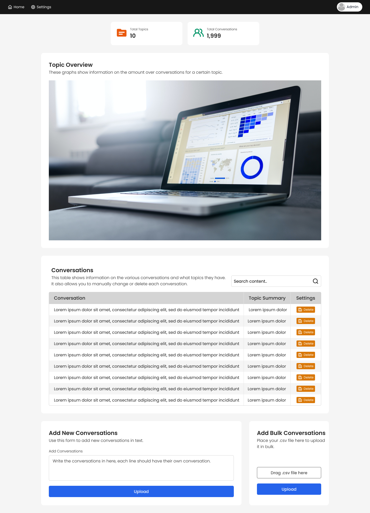

# Readme

* [Front-End](#front-end)
  * [Login Page](#login-page)
  * [Admin Dashboard](#admin-dashboard)
  * [Settings](#settings)
* [Exploratory Data Analysis](#exploratory-data-analysis)
* [Back-End](#back-end)
  * [Pre-Processing](#important-steps-for-pre-processing)
  * [Creating Model](#important-steps-for-creating-model)
  * [New Conversation Classification](#important-steps-for-new-conversation-classification)

## Front-End
Before I started working on the implementation of the Fron-End I planned the entire webapp on paper and Figma.

I created a list of requirements on paper:
* The webapp should have the admins login in order to use the service.
* After login the Admin should be shown various information on the models and topics.
* It should be clear without explanation how to (bulk) import new conversations.
* The admin should be able to change the summarised topic names (this might be useful for readability but requires some human work/research).
* The admin should be able to quickly see all different types of information in a clean and organized manner.

Using this (short) list of requirements a list of pages was made up and a tree diagram was created on paper:
* Login Page
* Dashboard home screen
  * Show overview of information in a graph
  * Show detailed information in a table
  * Allow admins to upload new conversations
* Settings Screen
  * Should allow to edit topics
  * ~~Create new accounts~~ *This is scrapped because it goes outside the scope of the case. As well as requiring more time than allotted to this case.*
  * ~~Upload new dataset to retrain the model~~ *This is scrapped because it goes outside the scope of the case. As well as requiring more time than allotted to this case.*
  

### Login Page
As mentioned previously the admin should be able to securely access the information they require in order to provide the right type of support. This is why a login page was designed, which should allow everything to be handled securely.

#### Design
For the design it was kept in mind that the eventual page should contain only the necessary information, such as a login form. A stock image was pulled from the internet and added to the design in order to give it a more modern look.

#### Implementation
The implementation for this page is quite simple, since I do not take a highly secure database for login as an important aspect for this case. This is why this implementation uses a simple login implementation, which will have to be improved when used in real life scenarios. This is also the reason why the `Forgot Password?` button is not working.

### Admin Dashboard
On the admin dashboard the admin should be able to have a quick overview of various pieces of information relevant to the topics of the support questions. For this example I've decided on using the following variables to fill the dashboard:
* Quick overview area - *These are mostly interesting facts about the data on the dashboard (Note, this is just an example)* 
  * Total Topics
  * Total Conversations
* Deep Information area - *This is a table with all conversations added by the admin with their topics*
* (Bulk) adding Conversations - *This should be a button that opens a form to upload more data to be processed*
  * For this it is important to add a notice of progress, so the admin does not think the program got stuck

#### Design
This design also was kept to a minimal, it contains only the relevant information and nothing else, because of this it is very easy for the admins to understand, the graph can be used to see what topics are relevant, and the admin is able to either manually copy and paste conversations, or upload a csv to add conversations in bulk.

#### Implementation
The implementation for this is relatively simple, the graph shows an image of `matplotlib` plots. And the new conversation adder links directly to the backend. The text based adding is directly added into the backend, while the bulk csv uploading requires the csv file to be parsed before it can be used.

### Settings
For an admin it is important to have access to some more information on what is shown. Using this setting screen the admin should be able to add new user accounts, change the topics, and retrain the data.

#### Design
The design is an example of the `settings` screen, this screen is not implemented due to time constraints, but should give an idea of what settings would be nice to have.

### General Implementation Strategy
Since Django is a new framework for me, I've implemented the design using the following steps:
* Implement the pages using basic html (without CSS).
  * Implement simple authentication
  * Implement showing of Graphs using `GraphJS`
  * Implement showing of Table from `sqlite`
  * Implement uploading new data to `sqlite`
  * Implement editing data from `sqlite`
* Design the pages by creating CSS based on the `Figma` designs mentioned above.
  * _Note, these designs are a little more simple in the eventual web application due to time constraints._

Each page was first written in plain HTML, after that was all working perfectly, the CSS code was written using both Bootstrap and Custom CSS to create the look and feel of the application.

### Database Design
In order to store all the information that is needed to get the web application up and running it is important to design what the database(s) will look like. The following information has to be stored somewhere in order for it to be re-used on the web application:
* Username / Password
* Conversations / Topics
* Topics / Summary - *Note, this is mainly useful for the readability of the application*

As mentioned previously the databases will be stored using `sqlite`, because it is a relatively lightweight db that is supported by `django` and allows for quick and easy access/manipulation.

## Exploratory Data Analysis
From Exploratory Data Analysis it became clear that:
* `df.head()`, `df.tail()`, and `df.sample()` shows that the items represented in the dataset are tweets sent between customers and a company's support team.
* There are `29156` duplicate tweets according to `df.duplicated().sum()`
* Messages contained various 'useless' characters, such as handles, tags, smileys, or URLs, these can easily be removed, while still keeping the main information of the tweet intact.
* Some messages end with a tag, such as `^`, `*`, or `-` which often shows who wrote the message. This means that these tags can also be removed from the text.
  * But this only occurs for support staff, which are filtered out because we need to look at support requests.
* Some messages carry very little information due to their word count
* Some messages are in different languages, since NLP is best when looking at english text the different languages can
  be removed.

## Back-End
In order for the Front-End to properly work it is important to have a fast and responsive Back-End. This Back-End is used for both training and classification purposes. But since the Front-End focuses on classification, the training has been done beforehand.
### Important Steps for Pre-Processing
After the quick round of EDA it is important to look at the data and see what can be removed and/or adapted in order to
have clean data to work with. From EDA, it became clear that the following had to be done in order to clean the data for
the NLP and ML pipeline to work efficiently.

* Look at all the different user tags, and decide which are companies and which are users. For this example it is
  assumed that the tweets with **@\<numerical\>** are tweets sent by a company to the user with **@\<numerical\>**, so
  these tweets can be removed.
* Remove all 'useless' characters using the `DataCleaner.py` script.
* Remove all duplicate tweets.

For this preprocessing step regex was used, since it turned out to be way quicker than cleaning with SpaCy, and resulted in a good enough baseline to continue with.

#### Methods for Speeding up the Pre-Processing
* Filter Optimization
    * Using Regex to filter before trying to run Spacy to lemmatize/filter
* Minimize the use of apply (this is often slower than a for loop)

### Important Steps for Creating Model
For creating a model it is very important to understand the various different models that could be used for topic classification.

First we have to decide on what type of Vectorizer to use, scikit-learn contains various vectorizers, such as:
* `CountVectorizer`, which converts a collection of text documents to a matrix of word counts.
* `TfidfVectorizer`, which converts a collection of text documents to a matrix of TF-IDF features.
* `HashingVectorizer`, which converts a collection of text documents to a matrix of word occurrences.

The `HashingVectorizer` performs best on very large datasets, since it does not rely on a vocabulary (or library) to count, but this also means that you have no use for the resulting dictionary of tokens. `TF-IDF` penalises the words that appear more frequent in the entire dataset, but this is not useful when deciding on what terms came across the most.
Because of these reasons `CountVectorizer` was chosen for this case, since the dataset is not too big, and `TF-IDF` is not useful because we should be dealing with raw counts; this also became clear when testing, the topics for `TF-IDF` were less coherent than the topics generated by `CountVector`.

After this we have to decide on what type of model to use for this case, various of these models are described in:
>Egger, R., & Yu, J. (2022). A Topic Modeling Comparison Between LDA, NMF, Top2Vec, and BERTopic to Demystify Twitter Posts. In Frontiers in Sociology (Vol. 7). Frontiers Media SA. https://doi.org/10.3389/fsoc.2022.886498 

According to this paper it is best to use `NMF`, since both `BERTopic` and `Top2Vec` require prior knowledge of the dataset ((semi-)supervised learning) and `LDA` performed worse than `NMF` on short tweets and requires a lot of hyperparameter tuning in order to work optimally.

After creating the model it is important to also save it, so it can be re-used later on for determining the topics of new conversations, in order to do this the `joblib` package was used, since it is advised to used by the `scikit-learn` documentation, the other widely used package, `pickle`, often is slower for very large arrays.

#### Methods for Speeding up the Model Creation
* Hyperparameter Tuning

### Important Steps for New Conversation Classification
For predicting topics of new conversations it is important to work with the previously created models. In order to do this the following steps were taken to predict the topics:
* Load the `joblib` files in order to create the `CountVectorizer` and `NMF` models.
* Initialize the topic keywords, by finding the most important feature names using the `Vectorizer` and `NMF`.
* To predict the eventual topic the following steps were needed:
  * Pre-Process the input
  * Transform the input using the `CountVectorizer` and `NMF`, this gives the eventual weights of each topic in relation to the conversation.
  * Find the topic with the highest weight, this will be the most likely topic of the conversation.

#### Methods for Speeding up the Model Creation
* Use as little loops as possible
* Use quick calculations